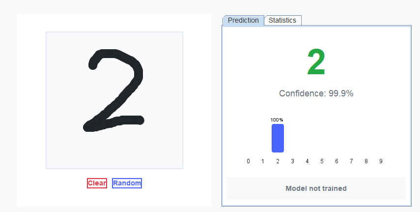

# NumSense



## 概要

NumSenseは、畳み込みニューラルネットワーク（CNN）を使用した手書き数字認識システムです。JavaでフルスクラッチでCNNを実装し、動的に生成されたMNIST風のデータで学習します。

## アーキテクチャ

### ネットワーク構造

```
Input (32×32×1)
    ↓
Conv1 (3×3×16, stride=1, padding=1)
    ↓
ReLU
    ↓
MaxPool (2×2, stride=2)
    ↓
Conv2 (3×3×32, stride=1, padding=1)
    ↓
ReLU
    ↓
MaxPool (2×2, stride=2)
    ↓
Flatten (2048)
    ↓
FC1 (128)
    ↓
ReLU + Dropout (0.5)
    ↓
FC2 (10)
    ↓
Softmax
```

### 詳細

#### 1. 畳み込み層（Convolution Layer）

畳み込み演算は以下の式で表されます：

$$Y_{i,j,k} = \sum_{m=0}^{M-1} \sum_{n=0}^{N-1} \sum_{c=0}^{C-1} X_{i \cdot s + m, j \cdot s + n, c} \cdot W_{m,n,c,k} + b_k$$

ここで：
- $X$: 入力テンソル（高さ×幅×チャンネル）
- $W$: カーネル重み（カーネル高さ×カーネル幅×入力チャンネル×出力チャンネル）
- $Y$: 出力テンソル
- $b$: バイアス
- $s$: ストライド
- $M, N$: カーネルサイズ
- $C$: 入力チャンネル数

#### 2. 活性化関数（ReLU）

Rectified Linear Unit (ReLU)は非線形性を導入します：

$$f(x) = \max(0, x)$$

導関数：
$$f'(x) = \begin{cases}
1 & \text{if } x > 0 \\
0 & \text{otherwise}
\end{cases}$$

#### 3. プーリング層（Max Pooling）

最大プーリングは受容野内の最大値を選択します：

$$Y_{i,j} = \max_{m,n \in \mathcal{R}_{i,j}} X_{m,n}$$

ここで $\mathcal{R}_{i,j}$ はプーリング領域です。

#### 4. 全結合層（Fully Connected Layer）

標準的な線形変換：

$$y = Wx + b$$

#### 5. Softmax関数

多クラス分類のための確率分布を生成：

$$\text{softmax}(x_i) = \frac{\exp(x_i)}{\sum_{j=1}^{K} \exp(x_j)}$$

オーバーフロー対策として最大値を引きます：
$$\text{softmax}(x_i) = \frac{\exp(x_i - \max(x))}{\sum_{j=1}^{K} \exp(x_j - \max(x))}$$

#### 6. 損失関数（Cross-Entropy Loss）

クロスエントロピー損失：

$$\mathcal{L} = -\sum_{i=1}^{N} \sum_{c=1}^{C} y_{i,c} \log(\hat{y}_{i,c})$$

One-hotエンコーディングの場合、単純化されます：
$$\mathcal{L} = -\log(\hat{y}_{i,t})$$

ここで $t$ は正解クラスです。

### 逆伝播（Backpropagation）

#### 1. Softmax + Cross-Entropyの勾配

組み合わせた勾配は驚くほどシンプルです：

$$\frac{\partial \mathcal{L}}{\partial z_i} = \hat{y}_i - y_i$$

#### 2. 全結合層の逆伝播

重みの勾配：
$$\frac{\partial \mathcal{L}}{\partial W} = \frac{\partial \mathcal{L}}{\partial y} \cdot x^T$$

バイアスの勾配：
$$\frac{\partial \mathcal{L}}{\partial b} = \frac{\partial \mathcal{L}}{\partial y}$$

入力への勾配：
$$\frac{\partial \mathcal{L}}{\partial x} = W^T \cdot \frac{\partial \mathcal{L}}{\partial y}$$

#### 3. 畳み込み層の逆伝播

重みの勾配（相関演算）：
$$\frac{\partial \mathcal{L}}{\partial W_{m,n,c,k}} = \sum_{i,j} \frac{\partial \mathcal{L}}{\partial Y_{i,j,k}} \cdot X_{i \cdot s + m, j \cdot s + n, c}$$

入力への勾配（転置畳み込み）：
$$\frac{\partial \mathcal{L}}{\partial X_{i,j,c}} = \sum_{k} \sum_{m,n} \frac{\partial \mathcal{L}}{\partial Y_{p,q,k}} \cdot W_{m,n,c,k}$$

ここで $(p,q)$ は $(i,j)$ に寄与する出力位置です。

## 最適化アルゴリズム

### Adam Optimizer

Adamは適応的学習率を持つ最適化手法です：

1次モーメント（平均）：
$$m_t = \beta_1 m_{t-1} + (1 - \beta_1) g_t$$

2次モーメント（分散）：
$$v_t = \beta_2 v_{t-1} + (1 - \beta_2) g_t^2$$

バイアス補正：
$$\hat{m}_t = \frac{m_t}{1 - \beta_1^t}$$
$$\hat{v}_t = \frac{v_t}{1 - \beta_2^t}$$

パラメータ更新：
$$\theta_t = \theta_{t-1} - \alpha \frac{\hat{m}_t}{\sqrt{\hat{v}_t} + \epsilon}$$

デフォルトパラメータ：
- $\beta_1 = 0.9$
- $\beta_2 = 0.999$
- $\epsilon = 10^{-8}$
- $\alpha = 0.001$ (学習率)

## 正則化技術

### 1. Dropout

学習時にランダムにニューロンを無効化：

$$y = \begin{cases}
\frac{x}{1-p} & \text{with probability } 1-p \\
0 & \text{with probability } p
\end{cases}$$

スケーリング係数 $\frac{1}{1-p}$ により、推論時の期待値を維持します。

### 2. データ拡張

以下の変換をランダムに適用：
- 回転：$\pm 15°$
- 平行移動：$\pm 2$ ピクセル
- スケーリング：$0.85 \sim 1.15$ 倍
- ノイズ追加：ガウシアンノイズ

### 3. 学習率減衰

エポックごとに学習率を減衰：
$$\alpha_{epoch} = \alpha_0 \times 0.9^{\lfloor epoch/10 \rfloor}$$

## パフォーマンス最適化

### 1. im2col変換

畳み込み演算を行列積として計算：

1. 入力を列形式に展開
2. カーネルを行形式に展開
3. 単一の行列積で計算

### 2. 並列処理

ForkJoinPoolを使用したマルチスレッド処理：
- 出力チャンネルごとに並列化
- 閾値（16チャンネル）以下は直接計算

## 実装の特徴

### 1. 動的データ生成

MNISTスタイルの手書き数字を動的に生成：
- 各数字に複数の書き方バリエーション
- リアルタイムでの歪み・ノイズ追加
- 無限のトレーニングデータ

### 2. モデル永続化

独自フォーマット`.jnn`（Java Neural Network）：
- バイナリ形式で高速な保存/読み込み
- 完全な重みとアーキテクチャ情報を保存

### 3. リアルタイム推論

描画しながらリアルタイムで認識：
- 32×32ピクセルへの自動リサイズ
- 確率分布の可視化

## システム要件

- Java 11以上
- メモリ：1GB以上推奨
- ディスク：モデルファイル用に10MB

## トラブルシューティング

### 学習が収束しない場合

1. 学習率を調整（0.0001〜0.01の範囲）
2. バッチサイズを変更（16〜64）
3. データ拡張の強度を調整

### メモリ不足の場合

1. バッチサイズを小さく
2. 並列処理のスレッド数を制限

## ライセンス

NumSense is licensed under the MIT License See the [LICENSE](LICENSE) file for more details.